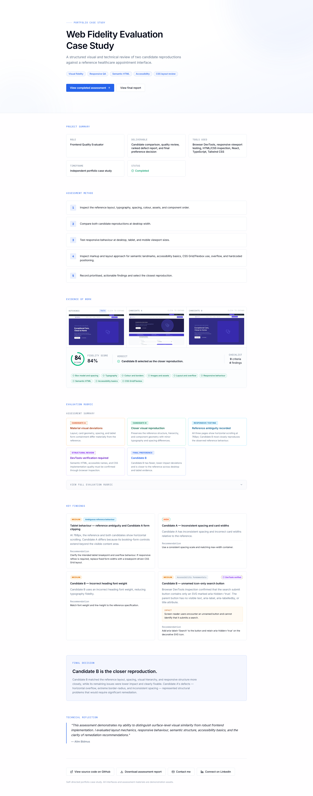
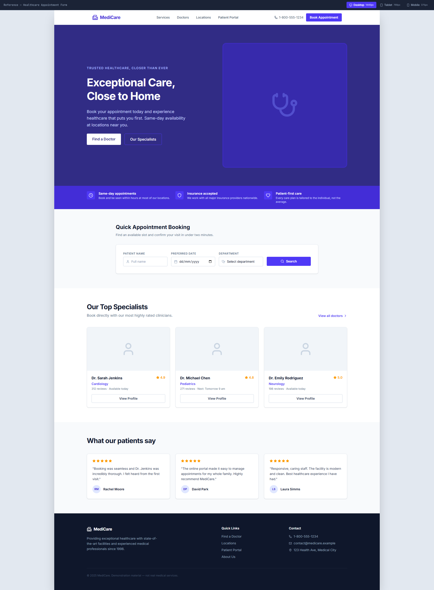
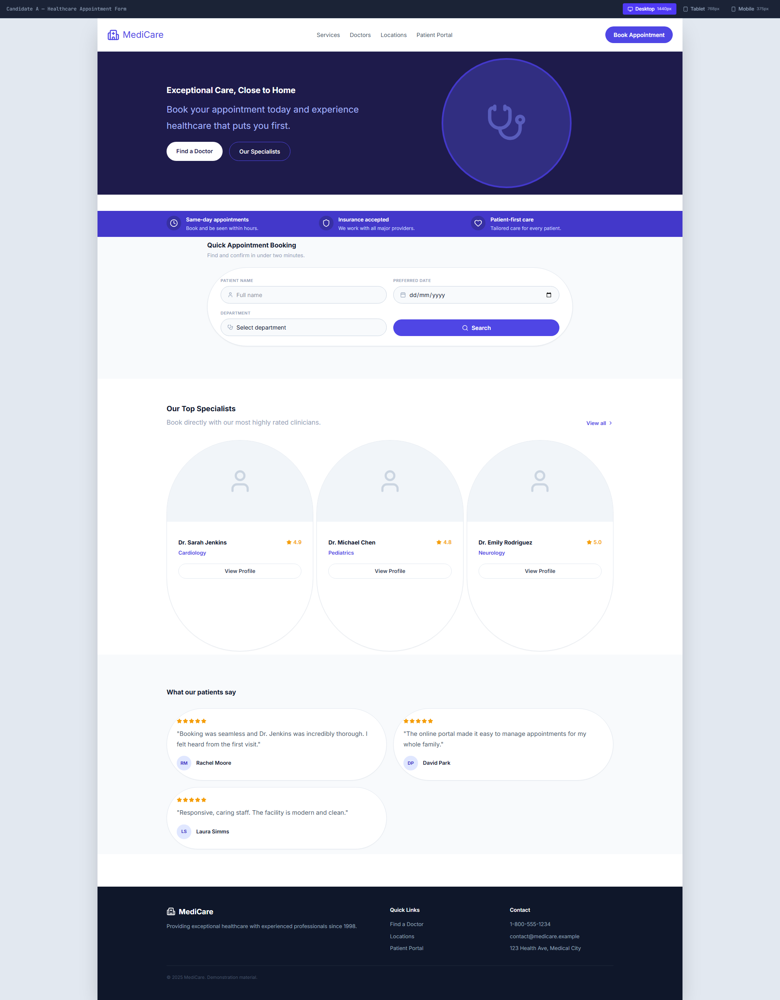
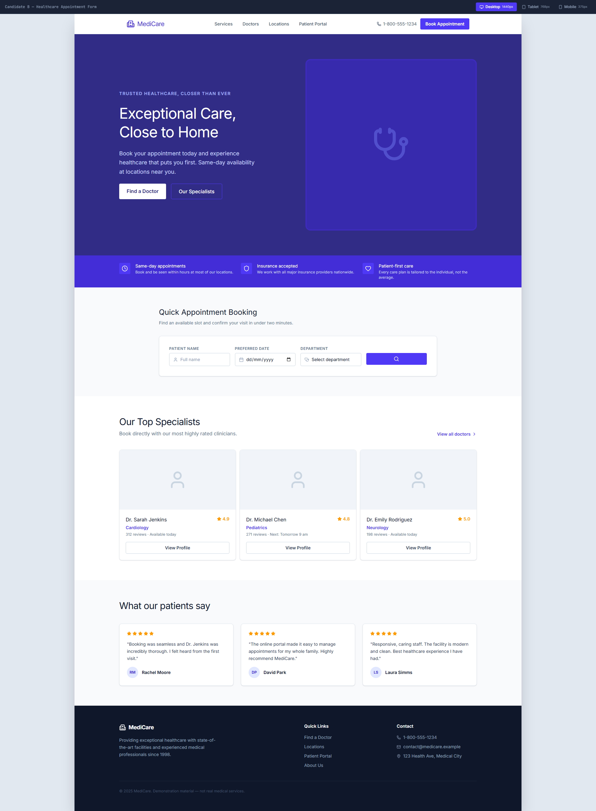
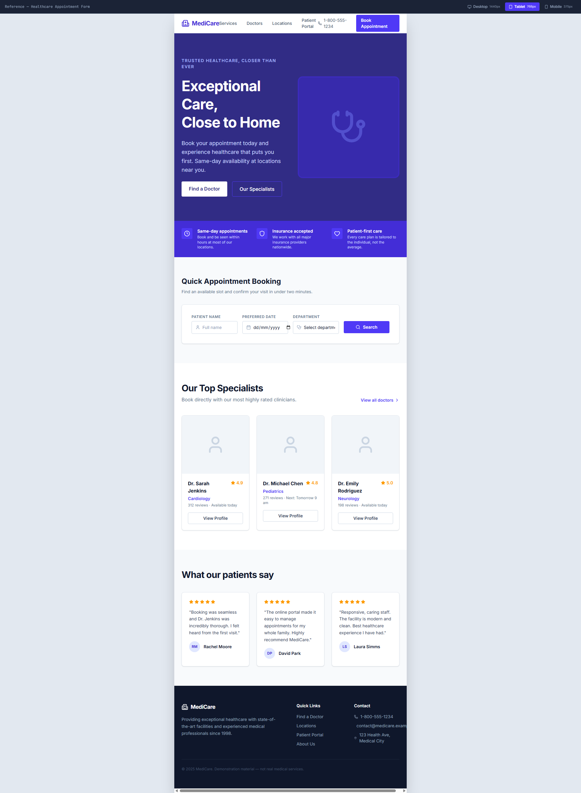
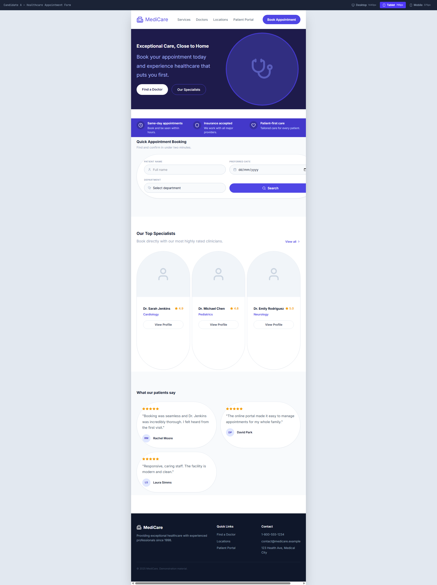
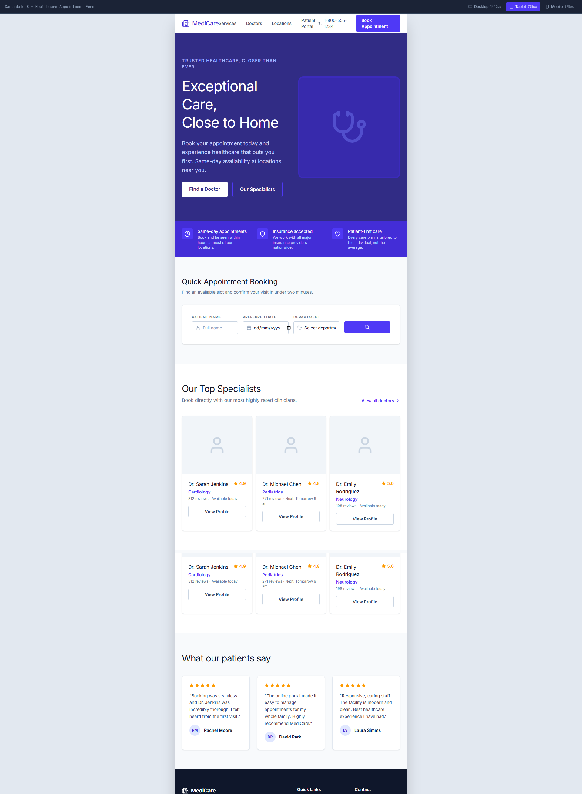

# Web Fidelity Evaluation Case Study

> A structured visual and technical assessment of two frontend reproductions against a reference healthcare appointment interface.

[View the live case study](https://portfolio-builder-alimbidmus57.replit.app/) · [View source code](https://github.com/medvendorhub/Web-Fidelity-Evaluation-Case-Study)

## Overview

This self-directed portfolio case study documents a completed frontend-fidelity assessment of two candidate reproductions against a reference healthcare appointment-form interface.

The work evaluates more than visual similarity at a single screen size. It assesses layout fidelity, typography, spacing, component geometry, responsive behaviour, semantic structure, accessibility fundamentals, and implementation resilience.

**Final preference:** Candidate B was selected as the closer reproduction.

## Assessment objective

Determine which candidate most closely reproduces the reference interface while recording clear, prioritised, and actionable findings.

The assessment included:

- Side-by-side reference, Candidate A, and Candidate B comparison at desktop width.
- Tablet comparison at 768px.
- Review of layout, spacing, type hierarchy, colour treatment, cards, content order, and overflow.
- Browser DevTools inspection of rendered markup and accessible controls.
- A structured findings log ranked by severity.
- A final evidence-based preference decision.

## Visual evidence

### Desktop reference

### Candidate A: desktop

### Candidate B: desktop

### Tablet comparison

| Reference | Candidate A | Candidate B |
|---|---|---|
|  |  |  |

## Evaluation criteria

| Criterion | What was assessed |
|---|---|
| Layout and spacing | Box model, alignment, container widths, gaps, and component dimensions |
| Typography | Font scale, weight, line-height, hierarchy, and wrapping |
| Visual treatment | Colour, borders, radius, shadows, assets, and component geometry |
| Responsive behaviour | Reflow, viewport overflow, form containment, and layout stability |
| Semantic structure | Meaningful landmarks, headings, forms, buttons, and document structure |
| Accessibility | Accessible names, labelled controls, keyboard support, and focus visibility |
| CSS implementation | Appropriate Grid/Flexbox usage and avoidance of brittle layout techniques |

## Key findings

### F-01 — Medium — Tablet behaviour: reference ambiguity and Candidate A form clipping

At 768px, the reference and both candidates show horizontal scrolling. Candidate A differs because its booking-form controls extend beyond the visible content area.

**Recommendation:** Clarify the intended tablet breakpoint and overflow behaviour. If responsive reflow is required, replace fixed form widths with a breakpoint-driven CSS Grid layout.

### F-02 — High — Candidate A: inconsistent spacing and card widths

Candidate A uses inconsistent spacing and mismatched card widths relative to the reference, changing the page’s visual rhythm and component hierarchy.

**Recommendation:** Use a consistent spacing scale and match the reference container and card dimensions.

### F-03 — Medium — Candidate B: incorrect heading font weight

Candidate B uses a lighter heading weight than the reference, reducing typographic fidelity while preserving the overall layout.

**Recommendation:** Match the reference font weight and line-height.

### F-04 — Medium — Candidate B: unnamed icon-only search button

Browser DevTools inspection confirmed that Candidate B’s search button contains only an SVG marked `aria-hidden="true"`. The parent button has no visible text, `aria-label`, `aria-labelledby`, or `title`.

**Impact:** Screen-reader users encounter an unnamed button and cannot identify that it submits a search.

**Recommendation:** Add `aria-label="Search"` to the button while retaining `aria-hidden="true"` on the decorative SVG.

## Decision rationale

Candidate B was selected as the closer reproduction because it more closely preserved the reference page’s structure, visual hierarchy, hero layout, booking-form geometry, specialist-card grid, testimonial arrangement, and footer composition.

Candidate A introduced broader and more visible deviations in spacing, component proportions, card treatment, and form containment. Candidate B’s remaining issues were lower-impact and more straightforward to remediate.

## Tools and skills

- React
- TypeScript
- Tailwind CSS
- Browser DevTools
- Responsive viewport testing
- Semantic HTML review
- Accessibility inspection
- CSS Grid and Flexbox assessment
- Structured quality evaluation and defect reporting

## Files

- `assets/` — Desktop and tablet comparison screenshots.
- `docs/` — Downloadable assessment report.
- `src/` — Source code for the portfolio case-study site.

## Project context

This is a self-directed portfolio case study. The interfaces, candidate reproductions, findings, and recommendations are demonstration materials created to show frontend quality-evaluation capability.

## Author

## Author

**Alim Bidmus**  
Frontend Engineer | Frontend Quality Evaluation  
[LinkedIn](https://www.linkedin.com/in/alim-bidmus-52aa0b73/)
